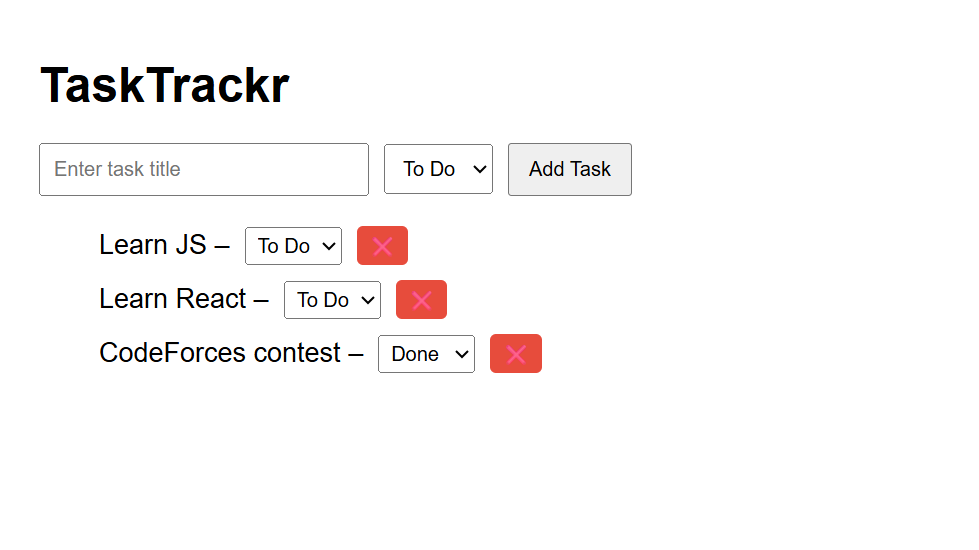

# TaskTrackr (MERN Stack Project)

A simple task tracker built using the MERN (MongoDB, Express, React, Node.js) stack where users can add, delete, and mark tasks as done and to do.

## Live Demo
Check out the live site: [https://tasktrackr-kappa.vercel.app](https://tasktrackr-kappa.vercel.app)
---

## Day 01
- Learned what is API, Express.js, MongoDB, React, localhost
- Understood why we need backend, frontend, and how they connect

## Day 02
- Created Express backend
- Set up MongoDB connection
- Made basic API to create and fetch tasks
- Tested API with Postman

## Day 03
- Created React frontend with `create-react-app`
- Connected React to backend using `axios`
- Fetched task list from API
- Displayed data in browser

---

## Tech Stack
- Backend: Node.js, Express.js, MongoDB, Mongoose , REST APIs to create and fetch tasks, tested using Postman.
- Frontend: React.js and Axios (to connect the frontend with the backend),JavaScript, HTML, CSS

## Preview
